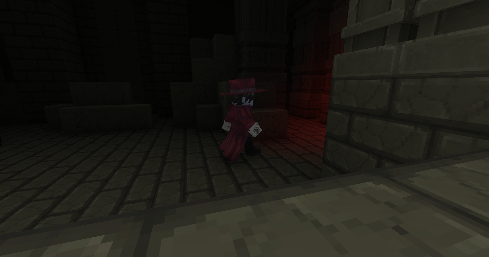

 

<figure>
  
  <figcaption>A pic I took but forgot to upload to curseforge, maybe the screenshots are too dimly lit ?</figcaption>
</figure>

## Dawn (Hytale updates start) 2026-02-10

Once Hytale came out I knew instantly that my first goal would be to release a mod, so I set out to do it right away!
 
I came up with a few ideas, but the one that stuck was making anime cosmetics because it seemed like something I didn't need to think that hard about, over the month I released some cosmetics like Goku's and Piccolo's Outfit, then Naruto, Sasuke... you get it.

And now we are here! With no updates in over a week... 

But don't you worry my little peeps, the wait is over! I will release an update once and for all !!

> &mdash; Finally a new update will come out.
> 
> &mdash; Dude it's only been a week.

But of course I'm not making this blog to only say this, who cares when a new update comes really, you just download it and go on with your life, nobody cares!

I'm making this to announce, or rather inform the new characters/cosmetics that I will add.

Since some of you have given suggestions I of course will add those to the mod, but since I'm only human it does take some time, so to give an idea here are the (probably) upcoming cosmetics!

* Frieren Summer
     *  Earrings
     *  Overtop
     *  Boots
     *  Pants
     *  Skirt
     *  Shirt and Jacket
* Frieren Winter
    * Winter Coat
    * Scarf
    * Winter dress
* Frieren Ancient
    * Dress
    * Cardigan
* Fern Summer
  * Long Dress
  * Long Coat
  * Boots
* Fern Winter
  * Winter Long Dress
  * Cropped Winter Jacket
  * Braided Scarf
* Fern Classy
  * Dress
  * Satin Gloves
  * Heels
* Stark Summer
  * Boots
  * Pants (with Sash)
  * Collared Shirt
  * Bandages
  * Jacket
* Stark Winter
  * Long Sleeves Shirt
  * Pants
  * Shoes
  * Winter Jacket
* Stark Classy
  * High Shoes
  * Brown Pants
  * Redcoat
  

> &mdash; huh, that's a lot of Frieren...

Yeah... I guess it's a lot. It will take some time (currently only Frieren Summer), so I will not release it all at once like I said in one comment.

For the other (pending) suggestions: I'm thinking of doing a vote sometime later.
 
# Download Anime Clothing <a href="https://www.curseforge.com/hytale/mods/anime-clothing" target="_parent">Here!</a>
