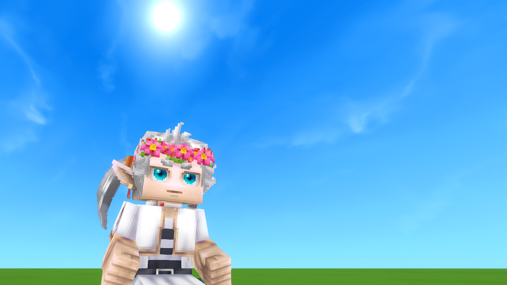

 

## Lalyan Cosmetic Core 2.0.1! (2026-02-11)

So Lalyan cosmetic core got a new update, and some cosmetics refused to appear so I got to working and now they show up, finally... It took me longer that I would like to admit so let's leave it at that. 

Since I know how variants work now the Naruto headbands are now united. 

<figure>
  
</figure>

Finally finished Frieren Summer Outift!!! Also Fern Summer Outfit is next.

### Also please respond the <a href="https://forms.gle/SorNZ51mXHoRHBcE6" target="_parent">survey</a>.

# Download the update <a href="https://www.curseforge.com/hytale/mods/anime-clothing" target="_parent">Here!</a>

