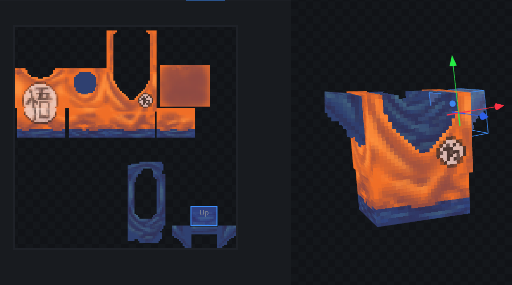
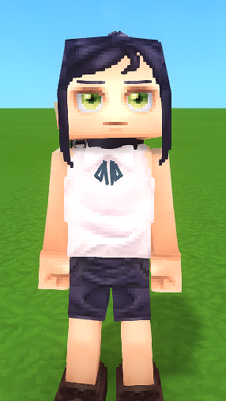
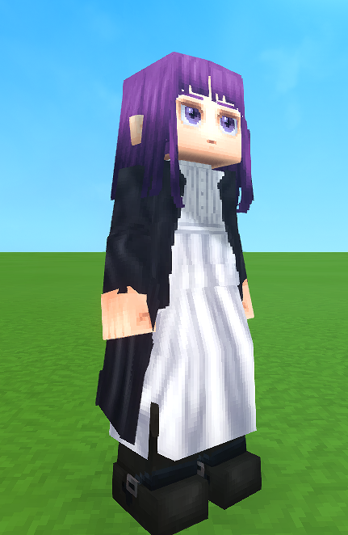

 

## Before the update (2026-02-14)

Expect this to be a quality of life update, I have added compatibility with the <a href="https://www.curseforge.com/hytale/mods/wardrobe" target="_parent">wardrobe</a> mod since someone suggested it and an arrange of small things that were changed/adjusted.

### Akatsuki Robe reworked

I'm one of the 3D designers in <a href="https://www.hycadia.org/" target="_parent">Hycadia</a> an upcoming Naruto server, so some of the things in the mod will be added here too, and because of that I had to rework the *Akatsuki Robe*, changed the shadows and added some **variations**! 

<figure>
  
</figure>

### Minor adjustments

I took the liberty of fixing the old Goku's Gi UV and added a little bit of detail.

<figure>
  
</figure>

I also changed the Demon Robe and Turban to add more detail since they were some of the first models I did and were not aging well.

### New Reze Cosmetics

New Reze Cosmetics will be available now! These don't take too much time to make so it was a quick and easy thing to do.

<figure>
  
</figure>

### Fern!

As I promised the Fern Summer outfit is done!

<figure>
  
</figure>

### Closing statements

Another thing is we are closing in on a month of this mod being released and so updates will probably slow down (more than this) because I want to do *other* mods, I have some ideas that I really don't work on because of working on this.

### Guys... <a href="https://forms.gle/SorNZ51mXHoRHBcE6" target="_parent">survey</a>.

